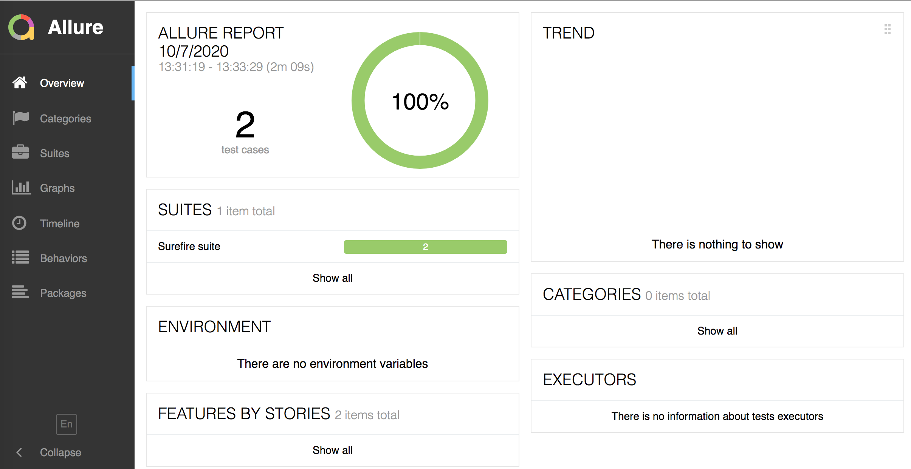
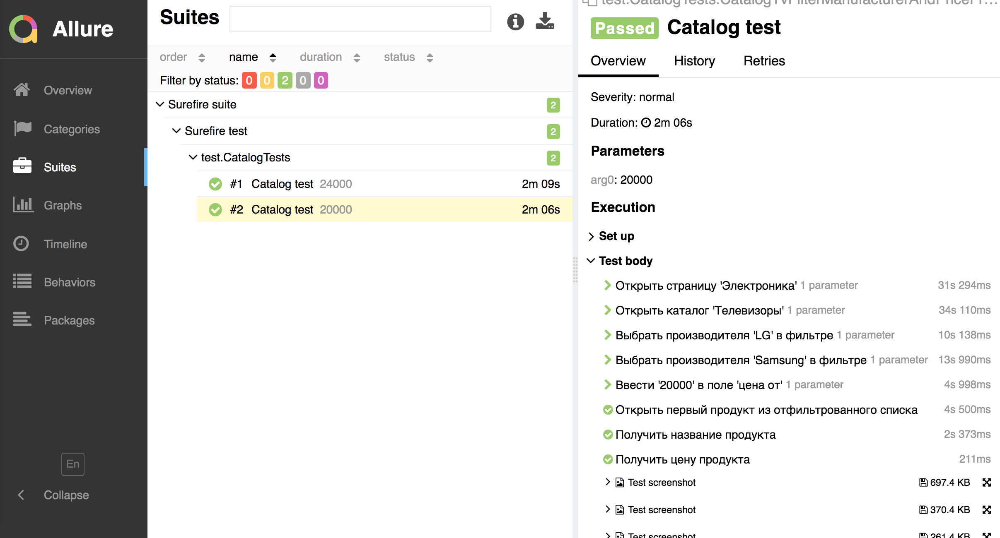
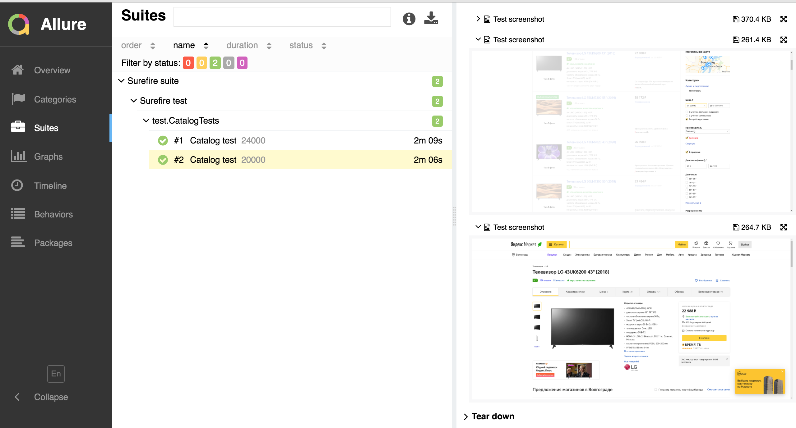

# Тестовое задание
## Языки и фреймворки

В проекте используются следующие языки и фреймворки:

* [Java 11](https://openjdk.java.net/projects/jdk/11/) -  язык программирования
* [TestNG](https://testng.org/doc/) - фреймворк для запуска и создания тестов
* [Seleium WebDriver](https://www.selenium.dev/) - фреймворк для автоматизации действий действий в веб браузере
* [Allure Report](https://docs.qameta.io/allure/) - отчет по тестированию
* [Log4J2](https://logging.apache.org/log4j/2.x/) - логгер для тестирования
* [Owner](http://owner.aeonbits.org/) - для хранения и использования конфигов
* [Selenoid](https://aerokube.com/selenoid/latest/) - сервер для запуска тестов

## Архитектура тестового проекта

В архитектуре тестового проекта можно выделить следующие элементы

* [Page Objects pattern](#page-objects-pattern)
* [BaseTest](#basetest)
* [TestListener](#testlistener)
* [Logging](#logging)
* [Configuration files](#configuration-files)
* [Parallel execution](#parallel-execution)
* [Data provider](#data-provider)

### Паттерн Page Objects 
Шаблон проектирования, который позволяет разделять логику выполнения тестов от их реализации.

#### AbstractPageObject
Базовый абстрактый класс страницы, все классы страниц должны расширять данный объект. 

#### Удаленнйы запуск
Данный тип выполнения использует RemoteDriverManager
класс для подключения к selenoid и создания экземпляра браузера.

Обязательно обратите внимания на файлы конфигурации: значения полей `selenoid.url` и `selenoid.port` 
в файле `general.properties`. Вы должны обновить эти значения перед запуском.

Если вы используете файл `/Docker/docker-compose.yml` для запуска selenoid, то значения из  `general.property` должны работать.

### BaseTest
Этот паттерн реализован в BaseWeb классе для автоматического выполнения предусловий и постусловий теста.

Предусловие использует  `@BeforeMethod` создает экземпляр браузера для выполнения теста согласно параметрам их xml файла.
Постусловие  `@AfterMethod` для закрытие браузера после выполнения теста.

### TestListener
 `TestListener` класс, реализующий интерфейс [ITestListener](https://testng.org/doc/documentation-main.html#logging-listeners).
Следующие методы используются для упрощения регистрации ошибок 
* `onTestStart`: добавляет информацию о браузере в отчет
* `onTestFailure`: добавляет скриншот упавшего теста в отчет
* `onTestSkipped`: добавляет пропущенный тест в отчет


### Параллельный запуск
Выполнение параллельных стестов основано на [parallel tests](https://testng.org/doc/documentation-main.html#parallel-tests) 
функции в TestNG. Эта функция использует конфигурационный файл `dataprovider.xml` с атрибутом `data-provider-thread-count="3"`, аннтоацию `@DataProvider(name = "dataProvider", parallel=true)` и указать созданный поставщик данных в аннтации `@Test(description = "Catalog test", dataProvider = "dataProvider")` 


### Файлы конфинурации
В этом проекте использется библиотека [Owner](http://owner.aeonbits.org/). Файлы, описывающией поля из конфигурационного файла находятся в классах: 
* Configuration
* ConfigurationManager

Файлы конфигурации находятся в `src/main/java/resources/conf`:
* `general.properties`


### Профили запуска в pom.xml

В папке  _src/test/resources/suites_ описан профиль _dataprovider_ для выполнения тестовго набора.
Что бы запустить профиль из командной строки можно вызвать параметр  `-P` и  идентефикатор профиля.

Пример: выполнение профиля dataprovider
``` bash
mvn test -Pdataprovider
```

* Изменить идентефикатор профиля

```xml
<profile>
   <id>web_execution</id>
</profile>   
```

* Заменить имя файла на `${suite}` в профиле

```xml
<configuration>
   <suiteXmlFiles>
      <suiteXmlFile>src/test/resources/suites/${suite}.xml</suiteXmlFile>
   </suiteXmlFiles>
</configuration>
```

* Используйте `-Dsuite=suite_name` для выбора профиля запуска
````bash
mvn test -Pweb_execution -Dsuite=dataprovider
````

### Allure
Allure используется для генерации отчета по пройденным тестам.

Запустить генерацию отчета нужно командой:
````bash
allure serve
````
Пример отчета: 








### Запуск
Для запуска достаточно запустить файл /Docker/run_test.sh
````bash
cd Docker
sh run_test.sh
````
Контролировать выполнение можно с помощью selenoid-ui http://localhost:8080/#/
